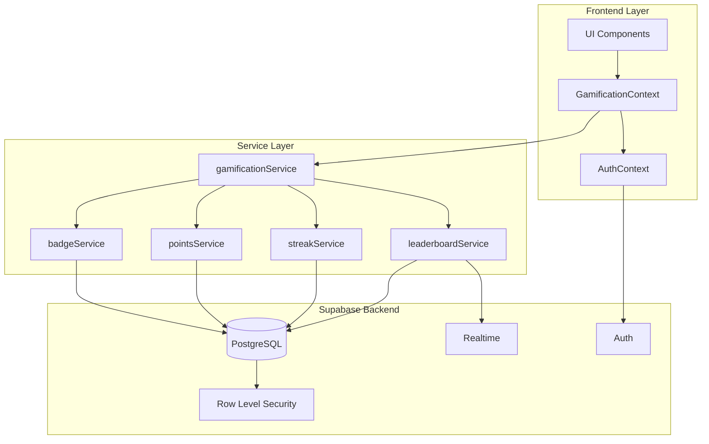

# Design Document: Gamification System

## Overview

The gamification system enhances user engagement on the SkillSwap platform through achievement badges, points/credits, leaderboards, streak tracking, and level progression. The system integrates seamlessly with the existing React/Vite/Tailwind/Supabase architecture while maintaining the platform's glassmorphic UI aesthetic.

### Key Design Principles

1. **Non-intrusive**: Gamification elements enhance rather than distract from core functionality
2. **Seamless Integration**: Uses existing design patterns (glassmorphic UI, Framer Motion animations, canvas-confetti)
3. **Performance-first**: Optimized database queries with proper indexing and caching strategies
4. **Security-focused**: Server-side validation and Row Level Security (RLS) prevent manipulation
5. **Scalable**: Designed to handle growing user base with efficient data structures

### Technology Stack

- **Frontend**: React 18, Framer Motion (animations), Lucide React (icons), canvas-confetti (celebrations)
- **Backend**: Supabase (PostgreSQL + Auth + Realtime)
- **Styling**: Tailwind CSS with glassmorphic design system
- **State Management**: React Context API (existing AuthContext pattern)

## Architecture

### System Components



### Data Flow

1. **User Action** → Frontend component detects action (trade completion, login, etc.)
2. **Service Call** → Component calls appropriate gamification service method
3. **Server Validation** → Supabase database function validates action server-side
4. **Points/Badge Award** → Database triggers update points, check badge eligibility
5. **Real-time Update** → Supabase Realtime pushes updates to subscribed clients
6. **UI Celebration** → Frontend displays animations (confetti, level-up modal, badge notification)
7. **Context Update** → GamificationContext updates local state for immediate UI reflection

## Components and Interfaces

### Database Schema

#### Tables

**1. user_badges**
```sql
CREATE TABLE user_badges (
  id UUID DEFAULT uuid_generate_v4() PRIMARY KEY,
  user_id UUID REFERENCES public.users(id) ON DELETE CASCADE NOT NULL,
  badge_type TEXT NOT NULL,
  earned_at TIMESTAMP WITH TIME ZONE DEFAULT NOW() NOT NULL,
  UNIQUE(user_id, badge_type)
);

CREATE INDEX idx_user_badges_user_id ON user_badges(user_id);
CREATE INDEX idx_user_badges_badge_type ON user_badges(badge_type);
CREATE INDEX idx_user_badges_earned_at ON user_badges(earned_at DESC);
```

**2. point_transactions**
```sql
CREATE TABLE point_transactions (
  id UUID DEFAULT uuid_generate_v4() PRIMARY KEY,
  user_id UUID REFERENCES public.users(id) ON DELETE CASCADE NOT NULL,
  points INTEGER NOT NULL CHECK (points != 0),
  reason TEXT NOT NULL,
  reference_id UUID, -- Optional: links to skill_id, trade_request_id, etc.
  reference_type TEXT, -- 'skill_created', 'trade_completed', 'streak_bonus', etc.
  created_at TIMESTAMP WITH TIME ZONE DEFAULT NOW() NOT NULL
);

CREATE INDEX idx_point_transactions_user_id ON point_transactions(user_id);
CREATE INDEX idx_point_transactions_created_at ON point_transactions(created_at DESC);
CREATE INDEX idx_point_transactions_user_created ON point_transactions(user_id, created_at DESC);
```

**3. user_streaks**
```sql
CREATE TABLE user_streaks (
  user_id UUID REFERENCES public.users(id) ON DELETE CASCADE PRIMARY KEY,
  current_streak INTEGER DEFAULT 0 NOT NULL CHECK (current_streak >= 0),
  longest_streak INTEGER DEFAULT 0 NOT NULL CHECK (longest_streak >= 0),
  last_activity_date DATE,
  freeze_count INTEGER DEFAULT 0 NOT NULL CHECK (freeze_count >= 0),
  updated_at TIMESTAMP WITH TIME ZONE DEFAULT NOW() NOT NULL
);

CREATE INDEX idx_user_streaks_current_streak ON user_streaks(current_streak DESC);
CREATE INDEX idx_user_streaks_last_activity ON user_streaks(last_activity_date);
```

**4. user_gamification (extends users table)**
```sql
-- Add columns to existing users table
ALTER TABLE public.users 
  ADD COLUMN IF NOT EXISTS level INTEGER DEFAULT 1 NOT NULL CHECK (level >= 1),
  ADD COLUMN IF NOT EXISTS total_points INTEGER DEFAULT 0 NOT NULL CHECK (total_points >= 0),
  ADD COLUMN IF NOT EXISTS points_to_next_level INTEGER DEFAULT 100 NOT NULL;
  
CREATE INDEX idx_users_total_points ON public.users(total_points DESC);
CREATE INDEX idx_users_level ON public.users(level DESC);
```

**5. leaderboard_cache (materialized view)**
```sql
CREATE MATERIALIZED VIEW leaderboard_cache AS
SELECT 
  u.id,
  u.name,
  u.picture,
  u.university,
  u.total_points,
  u.level,
  ROW_NUMBER() OVER (ORDER BY u.total_points DESC, u.created_at ASC) as rank
FROM public.users u
WHERE u.total_points > 0
ORDER BY u.total_points DESC, u.created_at ASC;

CREATE UNIQUE INDEX idx_leaderboard_cache_id ON leaderboard_cache(id);
CREATE INDEX idx_leaderboard_cache_rank ON leaderboard_cache(rank);
CREATE INDEX idx_leaderboard_cache_university ON leaderboard_cache(university);

-- Refresh function (called periodically or on significant updates)
CREATE OR REPLACE FUNCTION refresh_leaderboard_cache()
RETURNS void AS $$
BEGIN
  REFRESH MATERIALIZED VIEW CONCURRENTLY leaderboard_cache;
END;
$$ LANGUAGE plpgsql SECURITY DEFINER;
```

#### Database Functions

**1. award_points**
```sql
CREATE OR REPLACE FUNCTION award_points(
  p_user_id UUID,
  p_points INTEGER,
  p_reason TEXT,
  p_reference_id UUID DEFAULT NULL,
  p_reference_type TEXT DEFAULT NULL
)
RETURNS void AS $$
DECLARE
  v_new_total INTEGER;
  v_old_level INTEGER;
  v_new_level INTEGER;
BEGIN
  -- Insert transaction
  INSERT INTO point_transactions (user_id, points, reason, reference_id, reference_type)
  VALUES (p_user_id, p_points, p_reason, p_reference_id, p_reference_type);
  
  -- Update user total_points
  UPDATE public.users
  SET total_points = total_points + p_points
  WHERE id = p_user_id
  RETURNING total_points, level INTO v_new_total, v_old_level;
  
  -- Calculate new level
  v_new_level := FLOOR(SQRT(v_new_total / 100.0)) + 1;
  
  -- Update level if changed
  IF v_new_level > v_old_level THEN
    UPDATE public.users
    SET 
      level = v_new_level,
      points_to_next_level = (v_new_level * v_new_level * 100) - v_new_total
    WHERE id = p_user_id;
  ELSE
    UPDATE public.users
    SET points_to_next_level = ((v_old_level * v_old_level * 100) - v_new_total)
    WHERE id = p_user_id;
  END IF;
END;
$$ LANGUAGE plpgsql SECURITY DEFINER;
```

**2. check_and_award_badge**
```sql
CREATE OR REPLACE FUNCTION check_and_award_badge(
  p_user_id UUID,
  p_badge_type TEXT
)
RETURNS BOOLEAN AS $$
DECLARE
  v_already_has BOOLEAN;
  v_eligible BOOLEAN := FALSE;
  v_trade_count INTEGER;
  v_category_count INTEGER;
BEGIN
  -- Check if user already has badge
  SELECT EXISTS(
    SELECT 1 FROM user_badges 
    WHERE user_id = p_user_id AND badge_type = p_badge_type
  ) INTO v_already_has;
  
  IF v_already_has THEN
    RETURN FALSE;
  END IF;
  
  -- Check eligibility based on badge type
  CASE p_badge_type
    WHEN 'first_trade' THEN
      SELECT COUNT(*) >= 1 INTO v_eligible
      FROM trade_requests
      WHERE (requester_id = p_user_id OR skill_id IN (
        SELECT id FROM skills WHERE user_id = p_user_id
      )) AND status = 'completed';
      
    WHEN 'trader' THEN
      SELECT COUNT(*) >= 10 INTO v_eligible
      FROM trade_requests
      WHERE (requester_id = p_user_id OR skill_id IN (
        SELECT id FROM skills WHERE user_id = p_user_id
      )) AND status = 'completed';
      
    WHEN 'master_trader' THEN
      SELECT COUNT(*) >= 50 INTO v_eligible
      FROM trade_requests
      WHERE (requester_id = p_user_id OR skill_id IN (
        SELECT id FROM skills WHERE user_id = p_user_id
      )) AND status = 'completed';
      
    WHEN 'legend' THEN
      SELECT COUNT(*) >= 100 INTO v_eligible
      FROM trade_requests
      WHERE (requester_id = p_user_id OR skill_id IN (
        SELECT id FROM skills WHERE user_id = p_user_id
      )) AND status = 'completed';
      
    WHEN 'tech_master' THEN
      SELECT COUNT(*) >= 10 INTO v_eligible
      FROM trade_requests tr
      JOIN skills s ON tr.skill_id = s.id
      WHERE (tr.requester_id = p_user_id OR s.user_id = p_user_id)
        AND tr.status = 'completed'
        AND s.category = 'Tech';
        
    -- Similar patterns for other category badges...
    
    ELSE
      RETURN FALSE;
  END CASE;
  
  -- Award badge if eligible
  IF v_eligible THEN
    INSERT INTO user_badges (user_id, badge_type)
    VALUES (p_user_id, p_badge_type)
    ON CONFLICT (user_id, badge_type) DO NOTHING;
    RETURN TRUE;
  END IF;
  
  RETURN FALSE;
END;
$$ LANGUAGE plpgsql SECURITY DEFINER;
```

**3. update_streak**
```sql
CREATE OR REPLACE FUNCTION update_streak(p_user_id UUID)
RETURNS void AS $$
DECLARE
  v_last_activity DATE;
  v_current_streak INTEGER;
  v_freeze_count INTEGER;
  v_today DATE := CURRENT_DATE;
  v_days_diff INTEGER;
BEGIN
  -- Get or create streak record
  INSERT INTO user_streaks (user_id, current_streak, last_activity_date)
  VALUES (p_user_id, 0, NULL)
  ON CONFLICT (user_id) DO NOTHING;
  
  SELECT last_activity_date, current_streak, freeze_count
  INTO v_last_activity, v_current_streak, v_freeze_count
  FROM user_streaks
  WHERE user_id = p_user_id;
  
  -- If no previous activity, start streak at 1
  IF v_last_activity IS NULL THEN
    UPDATE user_streaks
    SET 
      current_streak = 1,
      longest_streak = GREATEST(longest_streak, 1),
      last_activity_date = v_today,
      updated_at = NOW()
    WHERE user_id = p_user_id;
    RETURN;
  END IF;
  
  -- Calculate days difference
  v_days_diff := v_today - v_last_activity;
  
  -- Same day - no change
  IF v_days_diff = 0 THEN
    RETURN;
  END IF;
  
  -- Consecutive day - increment streak
  IF v_days_diff = 1 THEN
    UPDATE user_streaks
    SET 
      current_streak = current_streak + 1,
      longest_streak = GREATEST(longest_streak, current_streak + 1),
      last_activity_date = v_today,
      updated_at = NOW()
    WHERE user_id = p_user_id;
    
    -- Award streak milestone bonuses
    IF v_current_streak + 1 = 7 THEN
      PERFORM award_points(p_user_id, 100, '7-day streak bonus', NULL, 'streak_milestone');
    ELSIF v_current_streak + 1 = 30 THEN
      PERFORM award_points(p_user_id, 500, '30-day streak bonus', NULL, 'streak_milestone');
      -- Award streak freeze
      UPDATE user_streaks SET freeze_count = freeze_count + 1 WHERE user_id = p_user_id;
    END IF;
    
  -- Missed day but have freeze
  ELSIF v_days_diff = 2 AND v_freeze_count > 0 THEN
    UPDATE user_streaks
    SET 
      freeze_count = freeze_count - 1,
      last_activity_date = v_today,
      updated_at = NOW()
    WHERE user_id = p_user_id;
    
  -- Streak broken
  ELSE
    UPDATE user_streaks
    SET 
      current_streak = 1,
      last_activity_date = v_today,
      updated_at = NOW()
    WHERE user_id = p_user_id;
  END IF;
END;
$$ LANGUAGE plpgsql SECURITY DEFINER;
```

#### Database Triggers

**1. Auto-award points on trade completion**
```sql
CREATE OR REPLACE FUNCTION trigger_award_trade_points()
RETURNS TRIGGER AS $$
DECLARE
  v_skill_owner_id UUID;
BEGIN
  -- Only process when status changes to 'completed'
  IF NEW.status = 'completed' AND (OLD.status IS NULL OR OLD.status != 'completed') THEN
    -- Get skill owner
    SELECT user_id INTO v_skill_owner_id
    FROM skills
    WHERE id = NEW.skill_id;
    
    -- Award points to requester (30 points)
    PERFORM award_points(NEW.requester_id, 30, 'Completed trade as requester', NEW.id, 'trade_completed');
    
    -- Award points to skill provider (50 points)
    PERFORM award_points(v_skill_owner_id, 50, 'Completed trade as provider', NEW.id, 'trade_completed');
    
    -- Check and award trade-related badges
    PERFORM check_and_award_badge(NEW.requester_id, 'first_trade');
    PERFORM check_and_award_badge(v_skill_owner_id, 'first_trade');
    PERFORM check_and_award_badge(NEW.requester_id, 'trader');
    PERFORM check_and_award_badge(v_skill_owner_id, 'trader');
    PERFORM check_and_award_badge(NEW.requester_id, 'master_trader');
    PERFORM check_and_award_badge(v_skill_owner_id, 'master_trader');
    PERFORM check_and_award_badge(NEW.requester_id, 'legend');
    PERFORM check_and_award_badge(v_skill_owner_id, 'legend');
  END IF;
  
  RETURN NEW;
END;
$$ LANGUAGE plpgsql SECURITY DEFINER;

CREATE TRIGGER trade_completion_points
  AFTER UPDATE ON trade_requests
  FOR EACH ROW
  EXECUTE FUNCTION trigger_award_trade_points();
```

**2. Auto-award points on skill creation**
```sql
CREATE OR REPLACE FUNCTION trigger_award_skill_points()
RETURNS TRIGGER AS $$
BEGIN
  PERFORM award_points(NEW.user_id, 10, 'Created skill post', NEW.id, 'skill_created');
  RETURN NEW;
END;
$$ LANGUAGE plpgsql SECURITY DEFINER;

CREATE TRIGGER skill_creation_points
  AFTER INSERT ON skills
  FOR EACH ROW
  EXECUTE FUNCTION trigger_award_skill_points();
```

**3. Update streak on activity**
```sql
-- This would be called explicitly from the frontend on login/activity
-- Or via a scheduled job that checks daily activity
```

#### Row Level Security Policies

```sql
-- user_badges
ALTER TABLE user_badges ENABLE ROW LEVEL SECURITY;

CREATE POLICY "Users can view all badges" ON user_badges
  FOR SELECT USING (true);

CREATE POLICY "System can insert badges" ON user_badges
  FOR INSERT WITH CHECK (false); -- Only via database functions

-- point_transactions
ALTER TABLE point_transactions ENABLE ROW LEVEL SECURITY;

CREATE POLICY "Users can view own transactions" ON point_transactions
  FOR SELECT USING (auth.uid() = user_id);

CREATE POLICY "System can insert transactions" ON point_transactions
  FOR INSERT WITH CHECK (false); -- Only via database functions

-- user_streaks
ALTER TABLE user_streaks ENABLE ROW LEVEL SECURITY;

CREATE POLICY "Users can view all streaks" ON user_streaks
  FOR SELECT USING (true);

CREATE POLICY "System can manage streaks" ON user_streaks
  FOR ALL USING (false); -- Only via database functions
```

### Frontend Components

#### 1. GamificationContext

Provides global gamification state and methods to all components.

```typescript
interface GamificationContextType {
  // State
  userStats: {
    level: number;
    totalPoints: number;
    pointsToNextLevel: number;
    currentStreak: number;
    longestStreak: number;
    freezeCount: number;
    badges: Badge[];
  } | null;
  
  leaderboard: LeaderboardEntry[];
  userRank: number | null;
  loading: boolean;
  
  // Methods
  refreshStats: () => Promise<void>;
  refreshLeaderboard: (filters?: LeaderboardFilters) => Promise<void>;
  showAchievement: (badge: Badge) => void;
  showLevelUp: (newLevel: number) => void;
}

interface Badge {
  id: string;
  badgeType: string;
  earnedAt: string;
  metadata: {
    title: string;
    description: string;
    icon: string;
    rarity: 'common' | 'rare' | 'epic' | 'legendary';
  };
}

interface LeaderboardEntry {
  id: string;
  name: string;
  picture: string;
  university: string;
  totalPoints: number;
  level: number;
  rank: number;
}

interface LeaderboardFilters {
  period: 'weekly' | 'monthly' | 'all-time';
  university?: string;
  category?: string;
}
```

#### 2. UI Components

**GamificationDashboard**
- Displays user's level, points, streak, and badges
- Shows progress bar to next level
- Displays recent point transactions
- Integrated into existing Dashboard component

**LeaderboardModal**
- Full-screen modal showing top 100 users
- Filters: time period, university, category
- Highlights current user's rank
- Animated rank changes
- Glassmorphic design matching existing modals

**BadgeNotification**
- Toast-style notification when badge earned
- Displays badge icon, title, description
- Confetti animation
- Auto-dismisses after 5 seconds
- Non-blocking overlay

**LevelUpModal**
- Celebratory modal when user levels up
- Shows old level → new level animation
- Lists newly unlocked features
- Confetti animation
- Requires user dismissal

**StreakIndicator**
- Small widget showing current streak
- Fire icon with streak count
- Displays freeze count
- Tooltip with streak history
- Integrated into Dashboard header

**BadgeDisplay**
- Grid of earned badges
- Locked/unlocked states
- Hover shows badge details
- Click for full badge information
- Integrated into Profile and Dashboard

**PointsAnimation**
- Floating "+X points" animation
- Appears near action trigger
- Fades out and floats up
- Uses Framer Motion

### Service Layer

#### gamificationService.js

```javascript
import { supabase } from '../lib/supabase';

export const gamificationService = {
  // Get user's gamification stats
  async getUserStats(userId) {
    const { data: user, error: userError } = await supabase
      .from('users')
      .select('level, total_points, points_to_next_level')
      .eq('id', userId)
      .single();
    
    if (userError) throw userError;
    
    const { data: streak, error: streakError } = await supabase
      .from('user_streaks')
      .select('current_streak, longest_streak, freeze_count')
      .eq('user_id', userId)
      .single();
    
    const { data: badges, error: badgesError } = await supabase
      .from('user_badges')
      .select('*')
      .eq('user_id', userId)
      .order('earned_at', { ascending: false });
    
    return {
      level: user.level,
      totalPoints: user.total_points,
      pointsToNextLevel: user.points_to_next_level,
      currentStreak: streak?.current_streak || 0,
      longestStreak: streak?.longest_streak || 0,
      freezeCount: streak?.freeze_count || 0,
      badges: badges || []
    };
  },
  
  // Get point transaction history
  async getPointHistory(userId, limit = 20) {
    const { data, error } = await supabase
      .from('point_transactions')
      .select('*')
      .eq('user_id', userId)
      .order('created_at', { ascending: false })
      .limit(limit);
    
    if (error) throw error;
    return data;
  },
  
  // Update streak (called on login/activity)
  async updateStreak(userId) {
    const { error } = await supabase.rpc('update_streak', {
      p_user_id: userId
    });
    
    if (error) throw error;
  },
  
  // Get leaderboard
  async getLeaderboard(filters = {}) {
    let query = supabase
      .from('leaderboard_cache')
      .select('*');
    
    if (filters.university && filters.university !== 'All') {
      query = query.eq('university', filters.university);
    }
    
    query = query.limit(100);
    
    const { data, error } = await query;
    if (error) throw error;
    
    return data;
  },
  
  // Get user's rank
  async getUserRank(userId) {
    const { data, error } = await supabase
      .from('leaderboard_cache')
      .select('rank')
      .eq('id', userId)
      .single();
    
    if (error) {
      if (error.code === 'PGRST116') return null; // User not in leaderboard
      throw error;
    }
    
    return data.rank;
  },
  
  // Subscribe to real-time leaderboard updates
  subscribeToLeaderboard(callback) {
    return supabase
      .channel('leaderboard_changes')
      .on('postgres_changes', {
        event: '*',
        schema: 'public',
        table: 'users',
        filter: 'total_points=gt.0'
      }, callback)
      .subscribe();
  }
};
```

## Data Models

### Badge Types and Metadata

```javascript
export const BADGE_DEFINITIONS = {
  // Trade milestones
  first_trade: {
    title: 'First Trade',
    description: 'Completed your first skill exchange',
    icon: 'Handshake',
    rarity: 'common',
    category: 'milestone'
  },
  trader: {
    title: 'Trader',
    description: 'Completed 10 skill exchanges',
    icon: 'TrendingUp',
    rarity: 'common',
    category: 'milestone'
  },
  master_trader: {
    title: 'Master Trader',
    description: 'Completed 50 skill exchanges',
    icon: 'Award',
    rarity: 'rare',
    category: 'milestone'
  },
  legend: {
    title: 'Legend',
    description: 'Completed 100 skill exchanges',
    icon: 'Crown',
    rarity: 'legendary',
    category: 'milestone'
  },
  
  // Category specialists
  tech_master: {
    title: 'Tech Master',
    description: 'Completed 10 trades in Tech category',
    icon: 'Code',
    rarity: 'rare',
    category: 'specialist'
  },
  arts_guru: {
    title: 'Arts Guru',
    description: 'Completed 10 trades in Arts category',
    icon: 'Palette',
    rarity: 'rare',
    category: 'specialist'
  },
  academic_helper: {
    title: 'Academic Helper',
    description: 'Completed 10 trades in Academic category',
    icon: 'GraduationCap',
    rarity: 'rare',
    category: 'specialist'
  },
  life_skills_expert: {
    title: 'Life Skills Expert',
    description: 'Completed 10 trades in Life Skills category',
    icon: 'Heart',
    rarity: 'rare',
    category: 'specialist'
  },
  
  // Special badges
  early_adopter: {
    title: 'Early Adopter',
    description: 'One of the first 100 users',
    icon: 'Rocket',
    rarity: 'epic',
    category: 'special'
  },
  helpful_mentor: {
    title: 'Helpful Mentor',
    description: 'Helped 25 different users',
    icon: 'Users',
    rarity: 'epic',
    category: 'special'
  },
  quick_responder: {
    title: 'Quick Responder',
    description: 'Average response time under 1 hour',
    icon: 'Zap',
    rarity: 'rare',
    category: 'special'
  }
};
```

### Point Award Rules

```javascript
export const POINT_RULES = {
  skill_created: 10,
  trade_completed_provider: 50,
  trade_completed_requester: 30,
  positive_feedback: 20,
  streak_7_days: 100,
  streak_30_days: 500
};
```

### Level Progression Formula

```javascript
// Level calculation: level = floor(sqrt(total_points / 100)) + 1
// Points required for level N: N^2 * 100

export function calculateLevel(totalPoints) {
  return Math.floor(Math.sqrt(totalPoints / 100)) + 1;
}

export function pointsForLevel(level) {
  return level * level * 100;
}

export function pointsToNextLevel(totalPoints, currentLevel) {
  const nextLevel = currentLevel + 1;
  const pointsNeeded = pointsForLevel(nextLevel);
  return pointsNeeded - totalPoints;
}

// Examples:
// Level 1: 0-99 points
// Level 2: 100-399 points (need 100 points)
// Level 3: 400-899 points (need 400 points)
// Level 4: 900-1599 points (need 900 points)
// Level 5: 1600-2499 points (need 1600 points)
```

### Feature Unlocks by Level

```javascript
export const LEVEL_UNLOCKS = {
  1: ['Basic profile', 'Create skills', 'Request trades'],
  5: ['Featured skill posts'],
  10: ['Priority search placement'],
  15: ['Custom profile theme'],
  20: ['Custom badge colors'],
  25: ['Exclusive leaderboard badge'],
  30: ['Profile verification badge']
};
```

